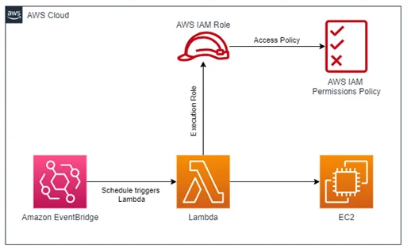

# terraform-aws-lambda-scheduler
Stop and start EC2 and RDS instances according to schedule via lambda and terraform.



# Overview

The scheduler looks at the schedule tag to see if it needs to stop or start and instance.
It works by setting a tag (default name schedule) to a string giving the stop and start time hour for each day.

A schedule tag for an EC2 instance is json and looks like:
```json
{"mon": {"start": 7, "stop": 19},"tue": {"start": 7, "stop": 19},"wed": {"start": [9, 22], "stop": 19},"thu": {"start": 7, "stop": [2,19]}, "fri": {"start": 7, "stop": 19}, "sat": {"start": 22}, "sun": {"stop": 7}}
```
If you want to handle multiple stop/starts per day, you will need to pass a list in square brackets in the start/stop schedule.

You can also use 'daily' and 'workday'. 'workday' is a placeholder for monday - friday.
This allow a much smaller configuration in tags. It is needed for configurations
with multiple times for stoppping an instance, because a value
of a tag is limitted to 254 characters.
The data from daily or workday will be added to any possible existing data of the weekday.

Example:
```json
{"daily": {"stop": [19,23,4]}, "sat": {"stop": 15},"sun": {"stop": [15]}}
```
A stop is planned for 4,19 and 23 for each day - including the additional value for saturday and sunday.

On a RDS instance the schedule tag is a string of keyword parameters separated by a space. To support multiple stop/start times per day, separate the hours with a `/`.
```
"mon_start=7 mon_stop=20 tue_start=7 tue_stop=20 wed_start=7/22 wed_stop=20 thu_start=7 thu_stop=2/20 fri_start=7 fri_stop=20"
```
NOTE: 
* This is because of restrictions in the characters the tags on RDS instance support.
* The configuration format from RDS can be used in EC2 as well. 

The scheduler can be configured to add a default schedule tag to EC2 and RDS instances it finds without a schedule tag.
It ignores instances that are part of autoscaling groups assuming scheduling actions can be used to stop and start these instances.


## Requirements

This module requires Terraform version `0.12.x` or newer.

## Dependencies

This module depends on a correctly configured [AWS Provider](https://www.terraform.io/docs/providers/aws/index.html) in your Terraform codebase.

## Usage

```
module "lambda-scheduler" {
  source = "neillturner/lambda-scheduler/aws"
  version = "0.x.0"
  schedule_expression = "cron(5 * * * ? *)"
  tag = "schedule"
  schedule_tag_force = "true"
  ec2_schedule = "true"
  rds_schedule = "true"
  default = "{\"mon\": {\"start\": [7], \"stop\": [19]},\"tue\": {\"start\": [7], \"stop\": [19]},\"wed\": {\"start\": [9, 22], \"stop\": [19]},\"thu\": {\"start\": [7], \"stop\": [2,19]}, \"fri\": {\"start\": [7], \"stop\": [19]}, \"sat\": {\"start\": [22]}, \"sun\": {\"stop\": [7]}}"
  time = "Europe/London"
  permissions_boundary = "arn:aws:iam::AWSACCTID:policy/optional-permissions-boundary-ARN"
}
```
## variables

### schedule_expression
The aws cloudwatch event rule schedule expression that specifies when the scheduler runs.

Default = "cron(5 * * * ? *)"  i.e. 5 minuts past the hour. for debugging use "rate(5 minutes)" See [ScheduledEvents](https://docs.aws.amazon.com/AmazonCloudWatch/latest/events/ScheduledEvents.html)

### tag
The tag name used on the EC2 and RDS instance to contain the schedule string for the instance. default is 'schedule'

### schedule_tag_force
Whether to force the EC2 and RDS instance to have the default schedule tag if no schedule tag exists for the instance.

Default is false. If set to true it with create a default schedule tag for each instance it finds.

### exclude
String containing comma separated list of ECS2 and RDS instance ids to exclude from scheduling.

### default
The default schedule tag containing json schedule information to add to EC2 or RDS instance when schedule_tag_force set to true.

NOTE: On a RDS instance the tag is converted to a string of keyword parameters separated by a space.  i.e.
```
"mon_start=7 mon_stop=20"
```
because of restrictions in the characters the tags on RDS instance support.

To support multiple stop/start times per day, separate the hours with a `/`. Example shows an instance that starts at 7, turns off at 19, then turns back on again from 22 to 1 the next day for weekly maintenance.
```
"mon_start=7/22 mon_stop=19 tue_start=7 tue_stop=1/19"
```

Default for default is:
```json
{"mon": {"start": [7], "stop": [19]},"tue": {"start": [7], "stop": [19]},"wed": {"start": [9, 22], "stop": [19]},"thu": {"start": [7], "stop": [2,19]}, "fri": {"start": [7], "stop": [19]}, "sat": {"start": [22]}, "sun": {"stop": [7]}}
```

### time
Timezone to use for scheduler. Can be 'local', 'gmt' or an Olson timezone from https://gist.github.com/ykessler/3349954. default is 'gmt'. local time is for the AWS region.

### permissions_boundary
An optional AWS IAM permissions boundary ARN to be attached to the AWS IAM role. default = "".

### ec2_schedule
Whether to do scheduling for EC2 instances. default = "true".

### rds_schedule
Whether to do scheduling for RDS instances. default = "true".

### security_group_ids
list of the vpc security groups to run lambda scheduler in. Defaults to []. Usually this does not need to be specified.

### subnet_ids
list of subnet_ids that the scheduler runs in. Defaults to []. Usually this does not need to be specified.

### resource_name_prefix
The prefix to apply to resource names. E.g. setting this to `cluster1-` will create the Lambda as `cluster1-aws-scheduler` rather than `aws-schedule`. default = "".
